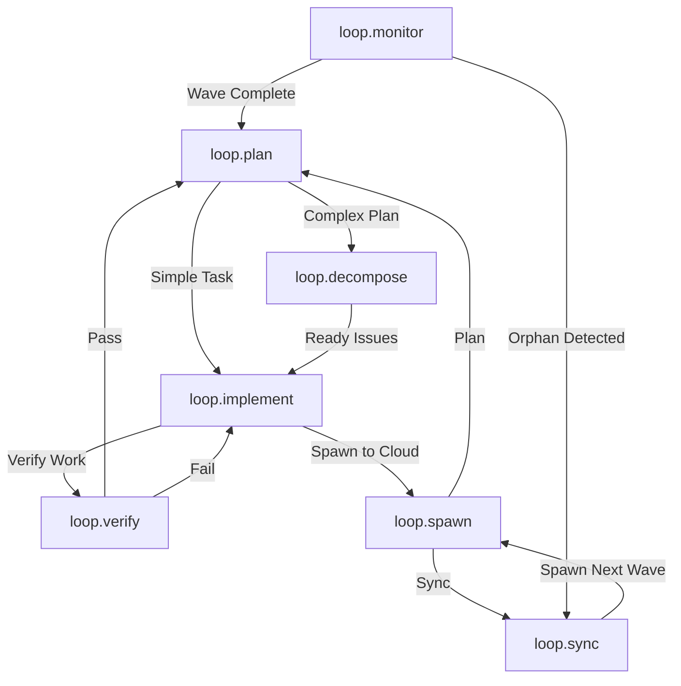

# Context Crate

Context Crate is a curated library of prompts, agents, meta-prompts, and operating instructions designed to supercharge GitHub Copilot users. By assembling reusable patterns for planning, coding, reviewing, and coordinating work, the crate enables teams to consistently deliver high-quality software faster.

## Why it exists
- **Double developer throughput:** Each artifact is engineered to help Copilot act as a force multiplier, aiming to boost individual productivity by roughly 2× through sharper task decomposition and decision support.
- **Ready-to-use building blocks:** Mix and match prompts to spin up specialized agents without starting from scratch.
- **Operational consistency:** Shared guidance keeps cross-functional collaborators aligned on communication norms, quality gates, and verification steps.

## Repository structure
- `README.md`: Overview of the Context Crate mission and structure.
- `AGENTS.md`: Operational instructions for the Loop System agents.
- `.github/agents/`: The specialized agents that power the Loop System.
  - `loop.plan.agent.md`: Project planning and issue tracking.
  - `loop.decompose.agent.md`: Breaks down plans into tracked issues.
  - `loop.implement.agent.md`: Executes coding tasks.
  - `loop.verify.agent.md`: Quality assurance and testing.
  - `loop.spawn.agent.md`: Dispatches work to the cloud.
  - `loop.monitor.agent.md`: Tracks cloud execution progress.
  - `loop.sync.agent.md`: Reconciles cloud work with local state.
- `.github/prompts/`: Meta-prompts and steering instructions for Copilot.
- `.github/addins/`: Modular capability extensions.
- `.beads/`: Local issue tracking database (JSONL).
- `history/`: AI-generated planning documents and architectural records.

## Agent Workflow

## Using the Loop System

The **Loop System** is a set of specialized agents designed to automate the software development lifecycle using the `beads` issue tracker.

### Prerequisites
- **Beads CLI (`bd`)**: Must be installed and available in your path.
- **GitHub CLI (`gh`)**: Required for cloud execution features.

### 1. Planning Work
Start by describing your task to the planner.
- **Command**: `@loop.plan "I need to add a user login system"`
- **Outcome**:
    - For simple tasks, it creates `beads` issues directly.
    - For complex tasks, it drafts a `PLAN.md` file in `history/` for your review.

### 2. Decomposing Plans
If you have a complex `PLAN.md`, use the decomposer to turn it into tracked work.
- **Command**: `@loop.decompose` (with the plan file open)
- **Outcome**: Parses the markdown and creates a hierarchy of Epics, Features, and Tasks in `beads`.

### 3. Implementation
Once issues are ready, the implementer takes over.
- **Command**: `@loop.implement`
- **Outcome**:
    - Picks the highest priority "ready" issue.
    - Creates a feature branch.
    - Writes code and tests.
    - Hands off to verification.

### 4. Verification
The verifier ensures quality before closing tasks.
- **Command**: `@loop.verify`
- **Outcome**:
    - Runs tests and linters.
    - If **Pass**: Closes the issue and hands back to planning.
    - If **Fail**: Returns to implementation with error logs.

### 5. Scaling to the Cloud (Optional)
For parallel execution of multiple tasks, use the cloud loop.
- **Spawn**: `@loop.spawn` - Dispatches ready issues to GitHub for parallel execution by Copilot.
- **Monitor**: `@loop.monitor` - Tracks progress of spawned waves.
- **Sync**: `@loop.sync` - Reconciles completed work from GitHub back to your local `beads` database.

## Contributing
- Keep new prompts agent-ready by following the structure described inside each meta-prompt.
- Document assumptions, verification steps, and deliverables so other developers can reuse the prompt confidently.
- Prefer descriptive filenames that communicate the agent’s purpose, such as `incident-responder.prompt.md`.

## License
Specify the license that governs contributions and usage when formalizing distribution.
